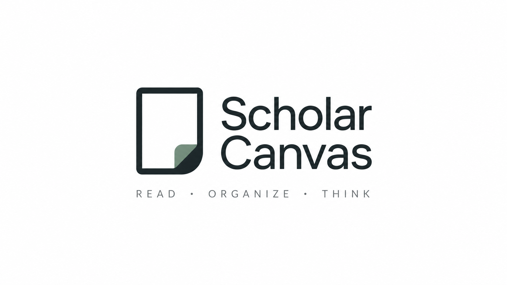

<p align="center">
  
</p>

# Scholar Canvas

**Markdown & Whiteboard for Zotero**

[](https://www.zotero.org)
[](https://github.com/l0o0/bamboo/releases)
[](./LICENSE)

**Write Markdown and connect your research on a visual whiteboard, inside Zotero.** Create, edit, and preview native `.md` attachments, then organize literature, quotes, and notes on `.canvas` whiteboards.

[English](README.md) | [简体中文](doc/README-zhCN.md)

---

## Why

Zotero is excellent for collecting and organizing research. In the AI era, **plain Markdown files** are the common currency of knowledge tools (Obsidian, LLMs, static sites, git).

[Better Notes](https://github.com/windingwind/zotero-better-notes) greatly improves Zotero's built-in **Notes**, but those notes are still Zotero notes — not native `.md` files on disk. **Scholar Canvas** fills that gap: it complements Better Notes without touching Notes, and its Markdown files are drop-in plain text for Obsidian and AI workflows.

---

## Features

### Markdown notes

- **Native files**: create and open `.md` attachments in a Zotero tab or standalone window; supports stored and linked files.
- **Three modes**: Live editing, Source editing, and read-only preview, with an outline, word counts, formatting shortcuts, and editable tables.
- **Linked notes**: Obsidian-style `[[file|alias]]` links, heading completion, and a right-hand backlinks sidebar, alongside the outline on the left. Duplicate filenames are distinguished with the Markdown attachment's item key in portable exports.
- **Full-text search**: search saved notes in the current library by title, filename, and body, then open a result at the matching text.
- **Math and footnotes**: `$…$`, `$$…$$`, fenced `math` blocks, and `[^name]` footnotes render in reading preview, HTML export, and Canvas note cards. Editing modes preserve their source syntax.
- **Images**: insert local images, import remote images for offline use, resize each occurrence, and view originals.
- **Portable export**: export notes with local images and either Wikilinks or standard Markdown links for Obsidian and other tools. Also export individual notes as HTML or PDF.
- **PDF annotations → Markdown**: select text excerpts and comments from a paper or PDF, then create a note with page labels and links back to the source annotations; supports personal and group libraries.

### Canvas whiteboards

- Create a blank `.canvas` whiteboard or start from a Zotero collection; drag in literature, PDF attachments, and other sources.
- Browse source annotations and connect Note, Question, Viewpoint, Evidence, and Summary cards with labeled, styled connections.
- Read Markdown directly on note cards, including headings, lists, code, links, math, and footnotes; edit the underlying text in place.
- Group cards in Frames; copy a whole selection, including group members and internal connections, and paste it into another whiteboard. Undo/redo applies to the whole paste.
- Arrange only selected cards or groups; arranging the entire board requires confirmation.
- Find cards by title or content with **Ctrl/Cmd+F**, and jump between matches.
- Export boards as PNG at 1×, 2×, or 4×, SVG, or Markdown. PNG captures the rendered board; SVG uses the existing text-based export layout.
- Learn with an example whiteboard featuring an offline image, an editable Markdown attachment, and hands-on exercises.

### Saving and workspace

- Debounced Markdown autosave and **Ctrl/Cmd+S**, with external file conflict detection for Markdown and Canvas.
- **Local history** for saved versions and conflicting drafts. Preview a version and save a recovery copy without overwriting the current file.
- **Workspace restore**: reopen previously open Markdown/Canvas tabs or windows. Markdown remembers its mode, cursor, and scroll position; Canvas retains its saved viewport.
- **Multiple monitors**: move documents between Zotero tabs and resizable standalone windows, saving before switching or closing.

Local history contains document text/card data, not image or PDF files, and stays on this device. Annotation conversion includes text and comments, not image-only excerpts. Cross-board paste preserves source references rather than copying source files or relative image assets.

See [link and export conventions](docs/obsidian-links.md), [save protection and recovery](docs/file-safety.md), and [feature usage and boundaries](docs/markdown-canvas-release-features.md) (the latter two guides are in Chinese).

### Planned

- Bidirectional YAML frontmatter ↔ Zotero field synchronization
- Automatic reload when an externally edited linked file changes; current conflict detection prevents silent overwrites

---

## Install

Download the latest `scholarcanvas-v{version}.xpi` from [Releases](https://github.com/l0o0/bamboo/releases), then in Zotero: **Tools → Plugins → gear → Install Plugin From File…** and restart if prompted.

### Development build

```bash
pnpm install
pnpm run build
# XPI: .scaffold/build/scholarcanvas-v{version}.xpi
```

---

## Usage

1. Select a library item → right-click → **New Markdown…**  
   A stored `.md` attachment is created and opened.
2. Edit in the tab. Changes autosave; use **Ctrl/Cmd+S** to save immediately.
3. Use **Live** or **Source** for editing; choose read-only preview from **More → Mode** to read the rendered document.
4. Double-click any `.md` attachment later to reopen the editor.
5. Or right-click a `.md` attachment → **Open with Markdown Editor**.

Use the tab's kebab menu for document metadata, renaming, opening the containing
folder, and Markdown-specific settings. **Import external images** downloads
`http(s)` image references into the attachment's `assets/` directory and
rewrites the Markdown links to local paths, so the document remains usable
offline.

In **Live** mode, click an image to show its size controls. Drag a corner to resize proportionally, choose **Small / Medium / Large**, or enter a width in pixels. **Auto** restores the natural size, capped to the reading column. Each occurrence keeps its own width; the original file is unchanged. One undo reverses a complete drag.

Sizes are saved in the `.md` file as `` and are respected in reading preview and HTML export. Narrow windows fit images to the available width. **View original** opens a temporary viewer with Fit and 100% views; clicking an image in reading preview opens the same viewer.

Drag existing `.md` files into Zotero (or attach linked files) — double-click still opens them here.

### Links, search, and recovery

- Type `[[` to find and link another note, optionally using `[[Note#Heading|Label]]`. Use the right-hand linked mentions panel to follow incoming references.
- Choose **More → Search library notes…** to search saved Markdown notes in the current library. **Ctrl/Cmd+F** searches within the current document.
- Right-click a paper or PDF → **Create Markdown from PDF annotations…**, select excerpts/comments, and create the note.
- Choose **More → Local history…**, or use the Markdown/Canvas attachment context menu, to preview a version and save a recovery copy. If an external edit causes a conflict, recover the draft before reopening and merging changes.
- Export a library's notes from **More → Export library notes for Obsidian… / Export library notes as Markdown…**. Local images are copied with rewritten paths; unresolved resources are listed in `REPORT.md`.

---

### Whiteboards

1. Choose **Tools → New Whiteboard…** or **New Whiteboard from Collection…**.
2. Drag a Zotero item onto the canvas, browse its excerpts, and add notes.
3. Group related cards in Frames and connect them to organize your argument.
4. Select cards or a Frame, then use **Ctrl/Cmd+C** and **Ctrl/Cmd+V** to copy them between boards. **More → Duplicate selection** creates a copy on the same board.
5. Use **More → Auto layout** to arrange the selection, or **Ctrl/Cmd+F** to locate a card. Press **Enter / Shift+Enter** to move through search results.
6. Reopen boards from **Tools → Recent Whiteboards** or their `.canvas` attachments.

For a guided introduction, choose **Help → Scholar Canvas: Create Example Whiteboard**. This creates a new board and a **Start writing.md** notebook with three hands-on exercises: summarize a reading, add a task, and insert an image. It also explains Live / Source modes and saving, then guides you back to the whiteboard to connect evidence and share your work. Existing tutorial boards are kept as they are.

To share a board, use **More → Export PNG** (2×), or right-click empty canvas space and choose **Export PNG · 1× / 2× / 4×**. The image includes the entire board with padding, uses the current theme, and excludes editor controls. Very large exports ask you to choose a lower resolution instead of silently reducing quality.

---

## Requirements

- Zotero **9** or **10**
- Desktop app (not Zotero Web)

---

## Development

Uses [zotero-plugin-scaffold](https://github.com/northword/zotero-plugin-scaffold) and [zotero-plugin-toolkit](https://github.com/windingwind/zotero-plugin-toolkit). Package manager: **pnpm**.

### Setup

```bash
# Copy env and point at your Zotero binary / profile / data dir (see .env.example)
cp .env.example .env

pnpm install
pnpm start          # build + launch Zotero with hot reload
```

China mainland users: project `.npmrc` already uses [npmmirror](https://npmmirror.com/).

### Scripts

For browser testing without Zotero, run `pnpm whiteboard:dev`. The whiteboard at
`/` and production Markdown editor at `/markdown.html` use the standalone
`@zotero-plugin/fake-zotero` development package. Run `pnpm test:fake-zotero`
for their integration tests. See the [browser testing guide](docs/fake-zotero.md)
for agent inspection, supported APIs, and manual adoption in other plugins.

| Command                 | Description                               |
| ----------------------- | ----------------------------------------- |
| `pnpm start`            | Dev server + hot reload                   |
| `pnpm run build`        | Production build + typecheck              |
| `pnpm test`             | Plugin tests                              |
| `pnpm test:unit`        | Unit and DOM regression tests             |
| `pnpm test:fake-zotero` | Fake-Zotero package and integration tests |
| `pnpm whiteboard:dev`   | Browser lab for Canvas and Markdown       |
| `pnpm run lint:check`   | Prettier + ESLint                         |
| `pnpm run lint:fix`     | Auto-fix lint                             |

---

## Configuration

**Edit → Settings → Scholar Canvas**

- **Enable Markdown editor for .md attachments** — when off, Zotero opens `.md` with the system handler again

---

## API for other plugins

Scholar Canvas was previously named Bamboo. The public API is `Zotero.scholarcanvas`, and packages use `scholarcanvas-v{version}.xpi`. The repository, add-on ID, preference keys, chrome resource namespace, and existing canvas data fields retain their compatibility identifiers.

Scholar Canvas exposes its in-process API at `Zotero.scholarcanvas.api.markdown`
for other plugins / MCP bridges to create and edit `.md` documents inside Zotero.
All methods are async, JSON-friendly, and reject with `MarkdownApiError`
(`error.code` is stable).

```js
const md = Zotero.scholarcanvas.api.markdown;

// List markdown attachments in the user library
const docs = await md.list({ q: "note" });

// Read one
const { content } = await md.read(docs[0].itemID);

// Create under a literature item, then edit
const created = await md.create({
  parentItemID: 123,
  initialContent: "# Title",
});
await md.update(created.itemID, { content: "# New\n\nupdated" });

// Patch frontmatter only
await md.patchFrontmatter(created.itemID, {
  set: { tags: ["ai", "draft"] },
  delete: ["old-key"],
});

// Open / flush / close editor tabs
await md.openTab(created.itemID);
await md.flush(created.itemID);
await md.closeTab(tabID);
```

Methods: `list`, `stat`, `read`, `create`, `createLinked`, `update`,
`patchFrontmatter`, `rename`, `trash`, `openTab`, `closeTab`, `sessions`,
`flush`, `toHtml`, `render`, `documentTitle`.

Error codes: `ITEM_NOT_FOUND`, `NOT_MARKDOWN`, `WRITE_CONFLICT`,
`WRITE_FAILED`, `INVALID_ARGUMENT`, `NOT_OPEN`.

Notes:

- All writes go through the same persistence path as the editor (file write,
  image-asset cleanup, item-title sync, Zotero file-sync marking).
- `update` rejects with `WRITE_CONFLICT` when an open editor tab has unsaved
  changes — `force: true` permits that API update, but does not bypass external file conflict checks.
- `rename` renames the underlying file; for linked attachments this renames
  the file on disk.
- API version: `Zotero.scholarcanvas.api.version` (currently `2`).

---

## FAQ

**Does this replace Better Notes?**  
No. Better Notes improves Zotero Notes. Scholar Canvas handles **real Markdown files** and **Canvas whiteboards** as attachments. Install both if you want.

**Where are files stored?**

- _New Markdown…_ creates a **stored** attachment under Zotero's storage.
- You can also attach **linked** files pointing at an Obsidian vault or any folder.

**Will Zotero sync my `.md` files?**  
Stored attachments follow Zotero file sync (if enabled). Linked files do not upload with Zotero file sync.

**Which extensions are recognized?**  
`.md`, `.markdown`, `.mdown`, `.mkd`, `.mkdn`, plus `text/markdown` content type.

---

## Contributing

Issues and PRs welcome. For larger features, open an issue first so we can align on scope.

---

## Acknowledgments

- Built on [zotero-plugin-template](https://github.com/windingwind/zotero-plugin-template)
- [markdown-it](https://github.com/markdown-it/markdown-it)
- Inspired by the knowledge workflows of Obsidian and the Zotero community

---

## License

[AGPL-3.0-or-later](./LICENSE)
